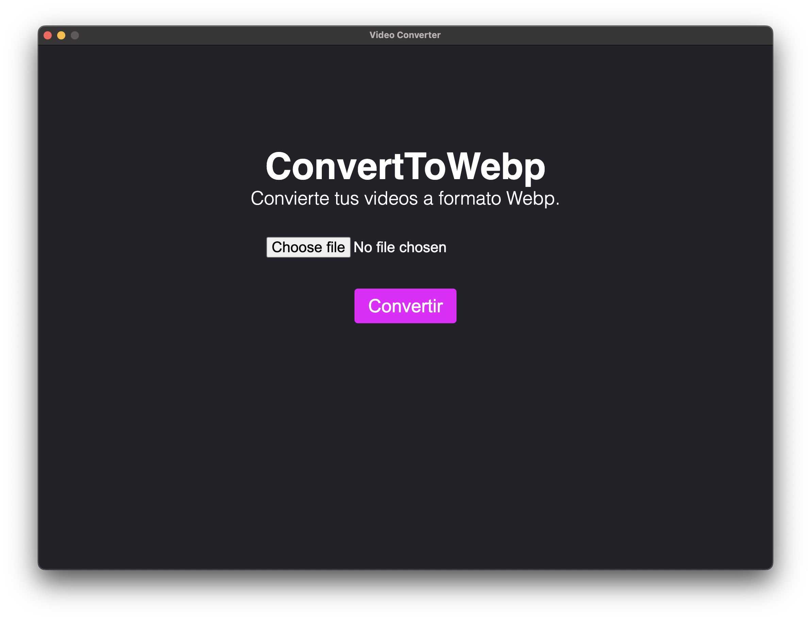

# Video Converter - NativePHP

Este proyecto es un conversor de video multiplataforma desarrollado con [NativePHP](https://nativephp.com/), que permite convertir archivos de video al formato **WebM**. La aplicación es muy fácil de usar e intuitiva.



## Características

- **Multiplataforma**: Funciona en Windows, macOS y Linux.
- **Formato soportado**: Convierte videos específicamente al formato WebM.
- **Interfaz intuitiva**: Diseñada para ser fácil de usar con una interfaz gráfica amigable hecha con **React**.
- **Conversión por lotes**: Convierte múltiples archivos al mismo tiempo.
- **Opciones de calidad**: Permite seleccionar la calidad del video de salida.
- **Previsualización**: Vista previa del video antes de la conversión.

## Requisitos del Sistema

- **PHP 8.2 o superior**
- **Extensiones de PHP** `simplexml`, `dom`, `bcmath`, `curl`, `libapache2-mod-php`, `php-mysql`, `php-xml`, `php-mbstring`, `php-zip`, `php-curl`, `php-redis`, `php-pcntl`, `php-intl` y `php-gd`.
- **Node y Yarn**: Necesarios para manejar la parte gráfica con React.
- **FFmpeg y codéc libavcodec-extra**: Herramienta de línea de comandos para procesar videos y audios.

## Instalación

Sigue estos pasos para configurar y ejecutar el proyecto:

1. **Clonar el repositorio**

   ```bash
   git clone https://github.com/manuog1994/video-converter
   cd conversor-video
   ```

2. **Instalar dependencias de PHP**

   Ejecuta el siguiente comando para instalar las dependencias del proyecto:

   ```bash
   composer install
   ```

3. **Instalar NativePHP**

   Si no tienes NativePHP instalado, sigue la [guía oficial](https://nativephp.com/docs/installation) para instalarlo.

4. **Instalar dependencias de Node.js**

   La interfaz gráfica está desarrollada con React, por lo que es necesario instalar las dependencias de Node.js. Asegúrate de tener instalado **Yarn** y luego ejecuta:

   ```bash
   yarn install
   ```

5. **Compilar la interfaz gráfica**

   Antes de poder ejecutar la aplicación, necesitas compilar la interfaz gráfica. Para ello, ejecuta:

   ```bash
   yarn build
   ```

6. **Configurar FFmpeg y FFprobe**

   Asegúrate de que FFmpeg y FFprobe estén instalados y accesibles desde la línea de comandos. Puedes verificar las instalaciones ejecutando:

   ```bash
   ffmpeg -version
   ffprobe -version
   ```

   Es necesario que especifiques las rutas a los binarios de FFmpeg y FFprobe en el archivo de configuración de la aplicación. Edita el archivo `.env` (o crea uno basado en `.env.example`) y agrega las siguientes líneas:

   ```env
   FFMPEG_BINARIES=/ruta/a/ffmpeg
   FFPROBE_BINARIES=/ruta/a/ffprobe
   ```

   Asegúrate de reemplazar `/ruta/a/ffmpeg` y `/ruta/a/ffprobe` con las rutas reales en tu sistema.

7. **Ejecutar la aplicación**

   Después de haber compilado la interfaz gráfica, puedes ejecutar la aplicación usando NativePHP:

   ```bash
   nativephp serve
   ```

   Luego, abre la aplicación desde el menú de tu sistema operativo.

## Uso

1. **Seleccionar archivos**: Pulsa sobre Choose file o Seleccionar Archivo.
2. **Convertir**: Haz clic en "Convertir" para iniciar el proceso. Puedes seguir el progreso de la conversión en tiempo real.
3. Al terminar la conversión aparecerá un mensaje de éxito y podrás encontrar tu archivo convertido en el directorio Documentos/Videos Conveter

## Contribución

Si deseas contribuir a este proyecto, sigue estos pasos:

1. **Fork del repositorio**
2. **Crear una rama de características** (`git checkout -b feature/nueva-caracteristica`)
3. **Commit de tus cambios** (`git commit -m 'Añadir nueva característica'`)
4. **Push a la rama** (`git push origin feature/nueva-caracteristica`)
5. **Crear un Pull Request**

## Licencia

Este proyecto está bajo la licencia MIT. Consulta el archivo [LICENSE](LICENSE) para más detalles.

## Agradecimientos

- A la comunidad de NativePHP y a Laravel por su increíble trabajo.
- A los desarrolladores de FFmpeg y FFprobe por sus poderosas herramientas de conversión y análisis de medios.

## Contacto

Para cualquier consulta o sugerencia, por favor contacta a [manuelortegagaliano@outlook.com](mailto:manuelortegagaliano@outlook.com).